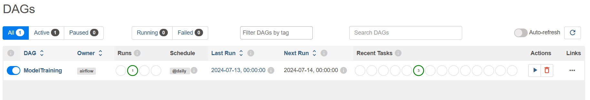
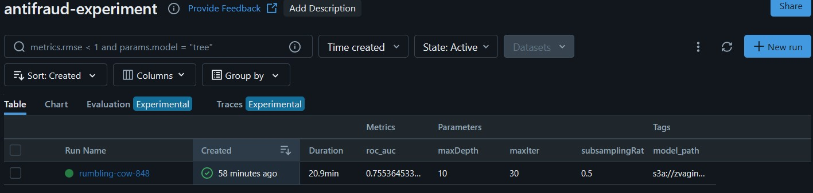
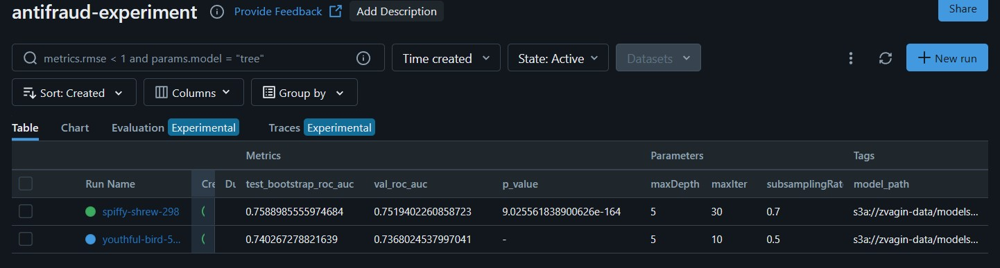
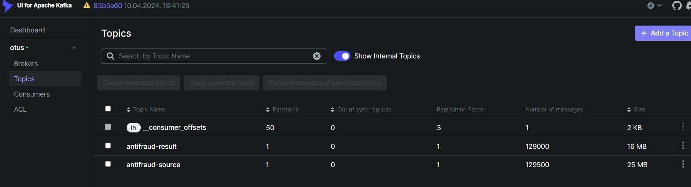

## Homework 2 
1. Перенес данные в свое s3 хранилище: s3://otus-course/
2. Создал кластер и скопировал туда данные 

3. За хранение наших данных в объектном хранилище мы отдадим около 250 руб в месяц, за хранение на кластере примерно в 100 раз больше - час работы кластера стоит 36 руб. 
4. Для снижения затрат на кластер можно попробовать уменьшить мощность машин на которых работает кластер

## Homework 3
1. Очистил данные от:  
    - Дубликатов  
    - Пропущенных значений
    - Выбросов в колонке tx_amount
    - Строк где customer_id -9999(Видимо это значение использовали когда customer_id был неизвестен) 

2. Сохранил обработанные данные в s3a://otus-course/prepared_data.parquet 

## Homework 4

1. Подготовил Airflow [даг](prepare_data/data_proc_dag.py) для запуска переодической очистки данных.
2. Запустил и протестировал даг

## Homework 5

1. Поднял все компоненты MLFlow(Tracker server, postgesql, s3 storage).
2. Запустил Airflow [даг](homework5/DAG_refit.py). Этот даг будет создавать кластер, запускать [скрипт](homework5/train.py) для обучения модели и логирования результатов в MLFlow, после этого удалять кластер.

### **Даг отработал**

### **Результаты залогировались**

## Homework 6

В скрипты([main.py](homework6/main.py), [train_model.py](homework6/train_model.py)) из прошлого задания, добавил код который загружает лучшую старую модель, и сравнивает качество моделей на бутстреп выборках с помощью Т-теста.

### **Результаты в MLFLow**

## Homework 7
Поднял Kafka, написал [producer.py](homework7/producer.py) и [consumer.py](homework7/consumer.py) для инференса на потоке. Протестировал производительность.

### **Kafka UI**

## Homework 8. Docker and K8s.
- Обернул модельку в сервис с помощью FastAPI
- Подготовил Dockerfile для сборки образа
- Настроил github actions для автоматической проверки кода, сбора и сохранения образа на docker hub
- Написал манифесты для деплоя сервиса на кластере Kubernetes
- Протестировал:)

#### Результаты.
[Код сервиса](docker/), [Yaml-файл для Github Actions](.github/workflows/docker.yaml), [Манифесты](k8s/)