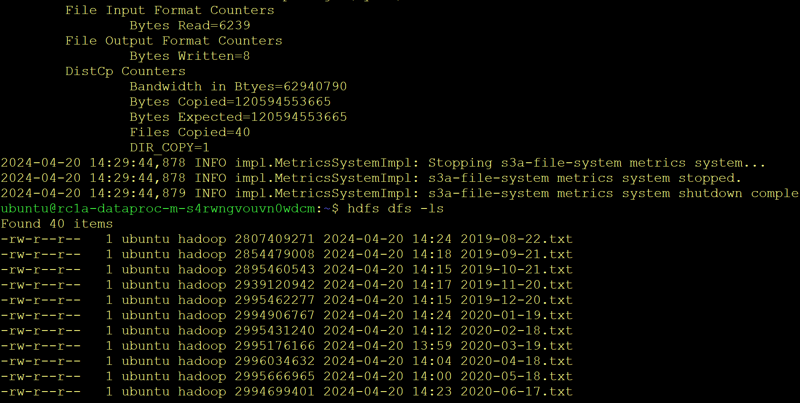

## Homework 2 
1. Перенес данные в свое s3 хранилище: s3://otus-course/
2. Создал кластер и скопировал туда данные 

3. За хранение наших данных в объектном хранилище мы отдадим около 250 руб в месяц, за хранение на кластере примерно в 100 раз больше - час работы кластера стоит 36 руб. 
4. Для снижения затрат на кластер можно попробовать уменьшить мощность машин на которых работает кластер
