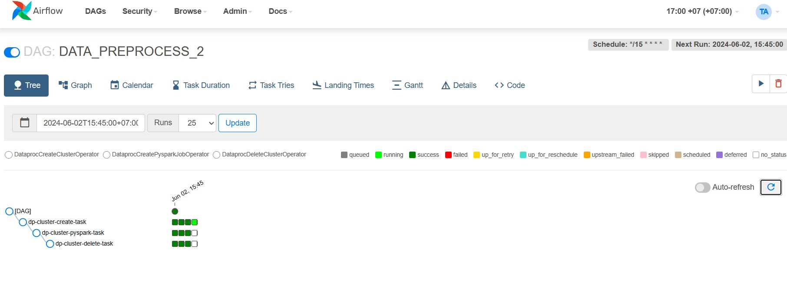

## Homework 2 
1. Перенес данные в свое s3 хранилище: s3://otus-course/
2. Создал кластер и скопировал туда данные 

3. За хранение наших данных в объектном хранилище мы отдадим около 250 руб в месяц, за хранение на кластере примерно в 100 раз больше - час работы кластера стоит 36 руб. 
4. Для снижения затрат на кластер можно попробовать уменьшить мощность машин на которых работает кластер

## Homework 3
1. Очистил данные от:  
    - Дубликатов  
    - Пропущенных значений
    - Выбросов в колонке tx_amount
    - Строк где customer_id -9999(Видимо это значение использовали когда customer_id был неизвестен) 

2. Сохранил обработанные данные в s3a://otus-course/prepared_data.parquet 

## Homework 4

1. Подготовил Airflow [даг](prepare_data/data_proc_dag.py) для запуска переодической очистки данных.
2. Запустил и протестировал даг

